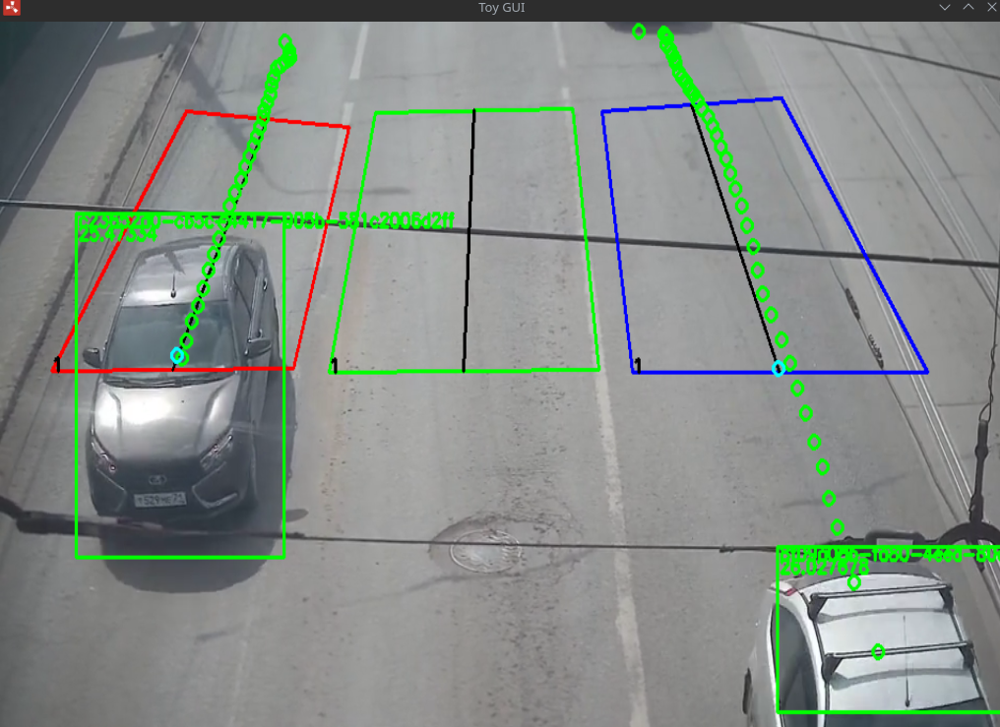
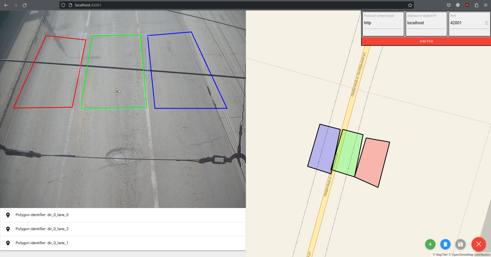
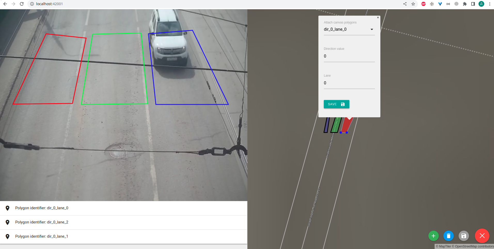

# W.I.P
# Rust toy utility for monitoring road traffic

## Table of Contents
- [W.I.P](#wip)
- [Rust toy utility for monitoring road traffic](#rust-toy-utility-for-monitoring-road-traffic)
  - [Table of Contents](#table-of-contents)
  - [About](#about)
  - [Installation and usage](#installation-and-usage)
  - [Screenshots](#screenshots)
- [ROADMAP](#roadmap)
  - [Support](#support)

## About

Vehicle detection/tracking and speed estimation via next instruments:
1. Rust programming language - https://www.rust-lang.org/
2. OpenCV bindings - https://github.com/twistedfall/opencv-rust#rust-opencv-bindings
3. Linear algebra - https://github.com/dimforge/nalgebra
4. YOLO v4 or v3 (its tiny version) - https://arxiv.org/abs/2004.10934 or https://arxiv.org/abs/1804.02767
5. actix-web for web part - https://actix.rs/

Notice:

UI is developed in seprate repository: https://github.com/LdDl/rust-road-traffic-ui. Therefore there is '[static_old](src/lib/rest_api/static_old/)' for just legacy and history + [static](src/lib/rest_api/static/)' for new one.

## Screenshots
* imshow() output:

    

    <details>
    <summary>Legacy screenshots</summary>
     | 
    </details>

* Web-UI for configuration:

     | 


## Installation and usage
1. You need installed Rust compiler obviously. Follow instruction of official site: https://www.rust-lang.org/tools/install
2. You need installed OpenCV and its contributors modules. I'm using OpenCV 4.5.5. I'd highly recommend to use OpenCV with CUDA. Here is [Makefile](Makefile) adopted from [this one](https://github.com/hybridgroup/gocv/blob/release/Makefile) if you want build it from sources (it's targeted for Linux user obviously).
    ```shell
    sudo make install_cuda
    ```

3. OpenCV's bindings have already meant as dependencies in [Cargo.toml](Cargo.toml)
4. Clone the repo
    ```shell
    git clone https://github.com/LdDl/rust-road-traffic.git
    ```
    Well, actually I provide yolov4-tiny configuration and weights file from [official repository](https://github.com/AlexeyAB/darknet) (authors of YOLOv4), but you are free to use yours.
    I provide video file as sample also.
    
    If you want to change parameters of this utility then navigate to [configuration file](data/conf.toml)

4. Download weights (optional)

    - YOLO v4 tiny - [yolov4-tiny-vehicles-rect_best.weights](yolov4-tiny-vehicles-rect_best.weights). It has been trained on filtered COCO dataset; classes are: "car", "motorbike", "bus", "train", "truck"

    - YOLO v3 tiny - [yolov4-tiny-vehicles-rect_best.weights](tinyv3-vehicles_best.weights). It has been trained on AIC HCMC 2020 challenge data; classes are: "car", "motorbike", "bus", "truck". More information here: https://github.com/LdDl/yolo_vehicles . I like it more personally.

5. Run
    ```shell
    cargo run path-to-toml-file
    ```
    If you want to use some Rust's optimizations then call build and run
    ```shell
    cargo build --release && ./target/release/rust-road-traffic path-to-toml-file
    ```
    If you want both optimized in term of perfomance and stripped executable binary (thanks to https://github.com/rust-lang/cargo/issues/3483)
    ```shell
    export RUSTFLAGS='-C link-arg=-s' && cargo build --release && ./target/release/rust-road-traffic path-to-toml-file
    ```
    If you want to do some REST calls you can do following (based on *rest_api* field in TOML configuration files)
    ```bash
    # Get polygons (GeoJSON) in which road traffic monitoring is requested
    curl -XGET 'http://localhost:42001/api/polygons/geojson'
    # Get statistics info for each polygon and each vehicle type in that polygon
    curl -XGET 'http://localhost:42001/api/stats/all'
    ```

    If you enabled MJPEG streaming and you want to adjust parameters for velocity estimation you could open http://localhost:42001/ in your browser and adjust polygons as you need (this UI still needs to be debugged and polished):

    

# ROADMAP
Please see [this](ROADMAP.md) file
## Support
If you have troubles or questions please [open an issue](https://github.com/LdDl/rust-road-traffic/issues/new).
