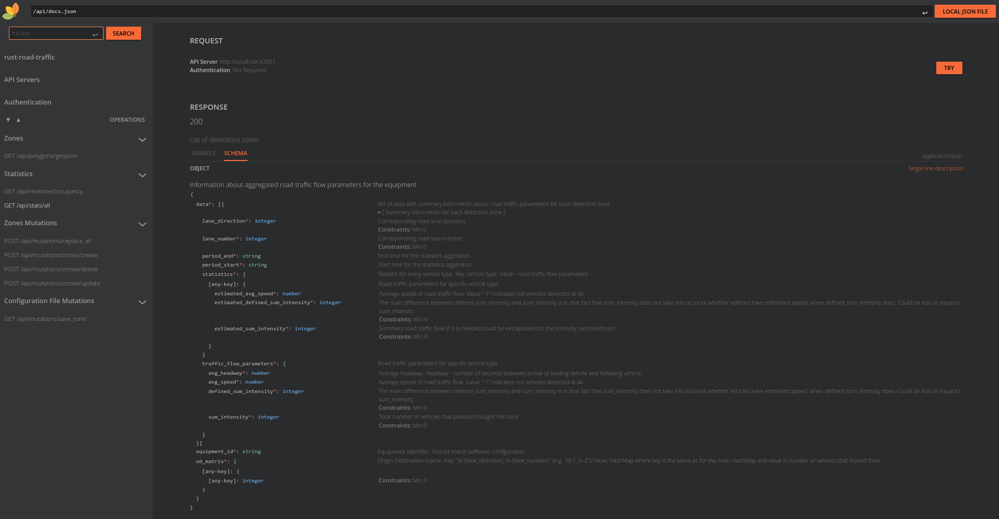

# Rust toy utility for monitoring road traffic

## Table of Contents
- [Video showcase](#video-showcase)
- [About](#about)
- [Traffic flow parameters](#traffic-flow-parameters)
- [Installation and usage](#installation-and-usage)
- [Virtual lines](#virtual-lines)
- [ROADMAP](#roadmap)
  - [Support](#support)

## Video showcase

<video src='https://github.com/user-attachments/assets/49fcc355-c05f-4847-961f-13a4abb1b0a6' width="720px"></video>

## About

Vehicle detection/tracking and speed estimation via next instruments:
1. Rust programming language - https://www.rust-lang.org/
2. OpenCV bindings - https://github.com/twistedfall/opencv-rust#rust-opencv-bindings. I'm using OpenCV 4.7.0 + v0.66.0 for bindings
3. Linear algebra - https://github.com/dimforge/nalgebra
4. Traditional YOLO v3 / v4 / v7 via OpenCV's DNN module - https://arxiv.org/abs/1804.02767 / https://arxiv.org/abs/2004.10934 / https://arxiv.org/abs/2207.02696
5. YOLO v8 via ONNX + OpenCV's DNN module - https://github.com/ultralytics/ultralytics
5. actix-web for web part - https://actix.rs/

Notice:

UI is developed in seprate repository: https://github.com/LdDl/rust-road-traffic-ui. Prepared `static` directory after `npm run build` is [here](src/lib/rest_api/static/)' 

## Traffic flow parameters

Both REST API and Redis publisher export following parameters for each user-defined vehicle class:

- __Flow__ (a.k.a intensity)

    Number of vehicles that pass given zone (or cross virtual line) in a specified period of time - `vehicles per period`.

    You can cast any given flow to `vehicles/hour` by multiplying the value by specific multiplier. E.g. software outputs 100 `vehicles per 15 minutes`, then you may have 100*15=1500 `vehicles/hour`.
    
    Look up at [Virtual lines](#virtual-lines) section on how vehicles are counted for additional information.

- __Defined flow__

    Same as just flow, but it is a number of vehicles that both pass given zone (or cross virtual line) in specified period of time and HAVE defined speed. Sometimes software just can't calculate speed, therefore _defined_ flow has been introduced. _This parameter could be renamed in further (in both documentation and code/api)._

- __Average speed of the flow__

   Basically it is just average value among all speeds of vehicles that pass given zone (or cross virtual line) in a specified period of time. If speed could not be determined due some circumstances it is considered to be `-1` (and not to be used in average aggregation).

For the all user-defined vehicles' classes there are:
- Same as for single vehicle class: __Flow__, __Defined Flow__, __Average speed of the flow__. 
- __Average headway__

    Average value amoung all calculated headway values. Headhway is the time that elapsed between the arrival of the leading vehicle and following vehicle to the zone (or virtual line).

    Let's break down an example: you have 3 vehicles crossed a certain virtual line at specific times: `[10:00:01, 10:00:07, 10:00:09]`. Then you have differences: `[10:00:07 - 10:00:01, 10:00:09 - 10:00:07]` which gives `[6 seconds, 2 seconds]` headways which gives `(6+2)/2 = 4 seconds` as average headway.

    You may ask: why average headway is not calculated for single class? 
    -- It does not make that much sense to estimate it because headway is not that representative for some specific classes (e.g. bus) due the nature of distribution of that classes among the popular ones (e.g. personal cars). It could be reconsidered in further for some edge cases (PR's are welcome).

* __OD (origin-destination) matrix__ - connections between different zones. Each connection is represented as number of vehicles moved from origin zone to destination one.

Locally you can access Swagger UI documentation via http://localhost:42001/api/docs:



## Screenshots
* imshow() output:

    

    <details>
    <summary>Legacy screenshots</summary>
     | 
    </details>

* Web-UI for configuration:

    

    

## Installation and usage
1. You need installed Rust compiler obviously. Follow instruction of official site: https://www.rust-lang.org/tools/install

2. You need installed OpenCV and its contributors modules. I'm using OpenCV 4.7.0. I'd highly recommend to use OpenCV with CUDA. Here is [Makefile](Makefile) adopted from [this one](https://github.com/hybridgroup/gocv/blob/release/Makefile) if you want build it from sources (it's targeted for Linux user obviously).
    ```shell
    sudo make install_cuda
    ```

    __Be aware: OpenCV < 4.7.0 probably wont work with YOLOv8 (even with ONNX opset12) if you need those.__

3. OpenCV's bindings have already meant as dependencies in [Cargo.toml](Cargo.toml)

4. Clone the repo
    ```shell
    git clone https://github.com/LdDl/rust-road-traffic.git
    ```
    Well, actually I provide yolov4-tiny configuration and weights file from [official repository](https://github.com/AlexeyAB/darknet) (authors of YOLOv4), but you are free to use yours.
    I provide video file as sample also.
    
5. Сhange parameters for this utility by using template of [configuration file](data/conf.toml). There is detailed explanation of each parameter.

6. Download weights and configuration files (optional)

    - YOLO v4 tiny - [yolov4-tiny-vehicles-rect_best.weights](https://github.com/LdDl/yolo_vehicles/releases/download/v0.0.1/yolov4-tiny-vehicles-rect_best.weights) + [yolov4-tiny-vehicles-rect.cfg](https://github.com/LdDl/yolo_vehicles/releases/download/v0.0.1/yolov4-tiny-vehicles-rect.cfg). It has been trained on filtered COCO dataset; classes are: "car", "motorbike", "bus", "train", "truck"

    - YOLO v3 tiny - [tinyv3-vehicles_best.weights](https://github.com/LdDl/yolo_vehicles/releases/download/v0.0.1/tinyv3-vehicles_best.weights) + [tinyv3-vehicles.cfg](https://github.com/LdDl/yolo_vehicles/releases/download/v0.0.1/tinyv3-vehicles.cfg). It has been trained on AIC HCMC 2020 challenge data; classes are: "car", "motorbike", "bus", "truck". More information here: https://github.com/LdDl/yolo_vehicles . I like it more personally.

7. Run
    ```shell
    cargo run path-to-toml-file
    ```
    If you want to use some Rust's optimizations then call build and run
    ```shell
    cargo build --release && ./target/release/rust-road-traffic path-to-toml-file
    ```
    If you want both optimized in term of perfomance and stripped executable binary (thanks to https://github.com/rust-lang/cargo/issues/3483)
    ```shell
    export RUSTFLAGS='-C link-arg=-s' && cargo build --release && ./target/release/rust-road-traffic path-to-toml-file
    ```

8. UI configuration

    If you enabled both REST API and MJPEG streaming and you want to adjust parameters for detection zones you could open http://localhost:42001/ in your browser and adjust polygons as you need (this UI still needs to be debugged and polished):

    

    Configuration file lines:
    ```toml
    [rest_api]
        enable = true
        host = "0.0.0.0"
        back_end_port = 42001
        api_scope = "/api"
        [rest_api.mjpeg_streaming]
            enable = true
    ```

7. Tracker configuration
    It is possible to pick either iou_naive or bytetrack tracker for tracking objects.

    It is not possible to adjust parameters of those trackers (but is planned in future works).
    ```toml
    [tracking]
        # Either "bytetrack" or "iou_naive". Default is "iou_naive"
        type = "iou_naive"
    ```

    Current parameters for IoU tracker:
    - max_no_match = 15
    - iou_treshold = 0.3

    Current parameters for ByteTrack tracker:
    - max_disappeared = 15
    - min_iou = 0.3
    - high_thresh = 0.7
    - low_thresh = 0.3
    - algorithm = Hungarian (matching algorithm)

8. REST API

    If you want to do some REST calls you can do following (based on *rest_api* field in TOML configuration files)
    ```bash
    # Get polygons (GeoJSON) in which road traffic monitoring is requested
    curl -XGET 'http://localhost:42001/api/polygons/geojson'
    # Get statistics info for each polygon and each vehicle type in that polygon
    curl -XGET 'http://localhost:42001/api/stats/all'
    ```
   
9. Export data

    If you've enabled Redis output you can connect to Redis server (e.g. via CLI) and monitor incoming messages:
    
    

    Configuration file lines:
    ```toml
    [redis_publisher]
        enable = true
        host = "localhost"
        port = 6379
        password = ""
        db_index = 0
        channel_name = "DETECTORS_STATISTICS"
    ```

    Both REST API and Redis publisher reset statistics in specific amount of time which could be adjusted via `reset_data_milliseconds` option:
    ```toml
    [worker]
        reset_data_milliseconds = 30000
    ```

## Virtual lines

This utility supports vehicle counting via two approaches:
| Vehicle appeared in the zone    | Vehicle crossed the line        |
:--------------------------------:|:--------------------------------:
 | 

_But what is the point to have optional virtual line for zone? Why just not use either line or zone at all?_

-- Well, zone is essential for estimating speed, so it is needed for sure. Why need line then: sometimes it is needed to register vehicles in specific direction only or at specific moment of time (in center of zone, in bottom of zone, after zone and etc.).

You can configure virtual lines via configuration file or via UI (look at [showcase](#video-showcase)):
```toml
[[road_lanes]]
    lane_number = 0
    lane_direction = 0
    geometry = [[204, 542], [398, 558], [506, 325], [402, 318]]
    geometry_wgs84 = [[-3.7058048784300297,40.39308821416677],[-3.7058296599552705,40.39306089952626],[-3.7059466895758533,40.393116604041296],[-3.705927467488266,40.39314855180666]]
    color_rgb = [255, 0, 0]
    # Remove lines below if you don't want to include virtual line
    # Note: There is only one possible virtual line for given zone 
    [road_lanes.virtual_line]
        geometry = [[254, 456], [456, 475]]
        color_rgb = [255, 0, 0]
        # lrtb - left->right or top-bottom object registration
        # rtbt - right->left or bottom->top object registration
        direction = "lrtb"
```

## ROADMAP
Please see [this](ROADMAP.md) file
## Support
If you have troubles or questions please [open an issue](https://github.com/LdDl/rust-road-traffic/issues/new).
